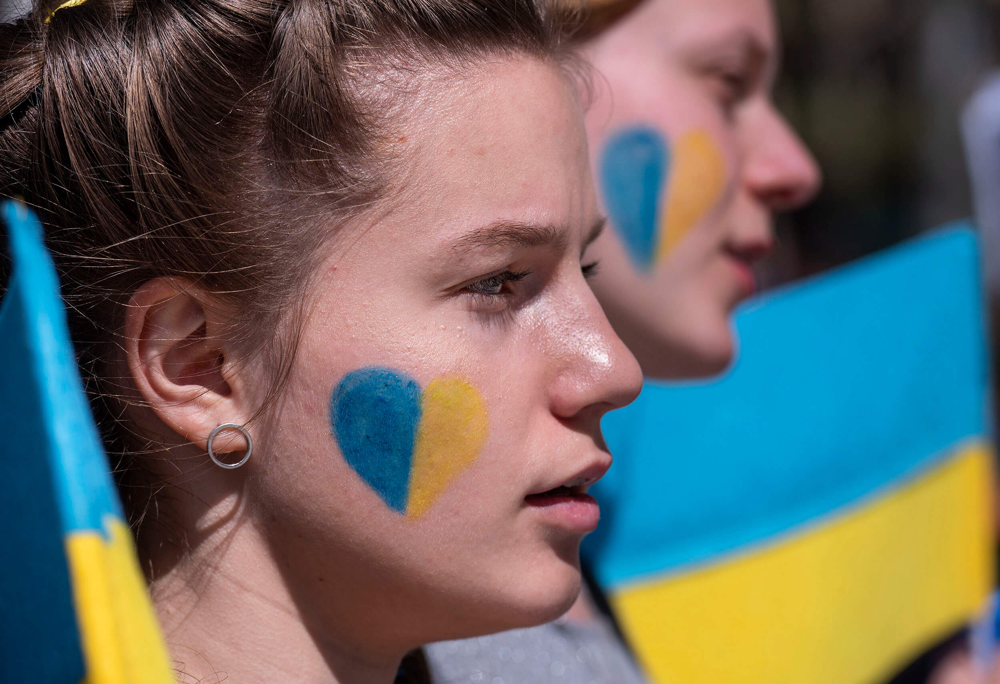
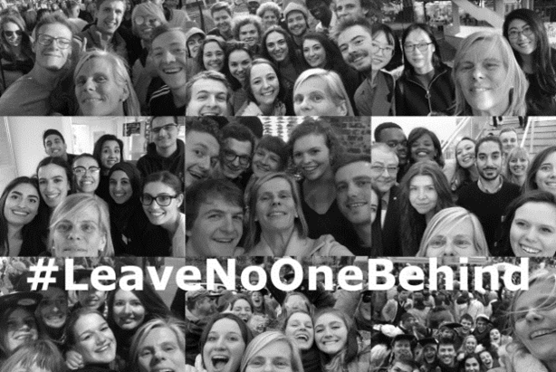

On March 17th, the Minister of Education of Wallonia-Brussels Federation Caroline Desir stated that over 130 Ukrainian students are already enrolled in FWB (Wallonia-Brussels Federation) schools, but this number ‘will increase very quickly and very very strongly.’ With the war impacting students directly, a question hangs in the air: Is it fair that Russian students are receiving support alongside Ukrainians?

Young Ukrainians have seen their life turned around completely since Russia’s invasion of Ukraine on February 24th. Their education plans are now just a mere speck of their imagination – unpredictable and unknown. The Russia-Ukraine war has put scholars’ future in danger. Hundreds have either found refuge in Brussels or seeking support from the European capital where they’ve been living before the war started. Either way, within all the tragic events, an ethical dilemma is looming over organizations funding student victims of the war. Vrije Universiteit Brussel is directing all the donations received for the university’s foundation to the VUB Caroline Pauwels Relief Fund, with the mission of helping students who have been affected by the war. With a hashtag #LeaveNoOneBehind, the fund-rising initiative is aimed at both Ukrainian and Russian students

Madina Mahomedova, 21, is an art student at Sint Lucas University Antwerp. With Russian students getting funding along Ukrainian students, Madina shares a sentiment of frustration along her other Ukrainian peers.

> *‘When it comes to financial support – or support of any kind – I believe that Ukrainian students should be a priority now.’*

There have been many debates regarding the ethical implications of helping both Ukrainians and Russians. While victims of the war strongly believe that it is unfair for the people of the aggressor to be given support alongside them, many organisations disagree. The VUB foundation is one of them: ‘No one, outside of one regime, chose this war.'

Erkut Gultekin, the Fundraising & Communications Officer at the VUB foundation, states that the ratio of Ukrainian-Russian students helped by the foundation is 70-30%.

> *‘There are a lot of things going on right now and we’re trying to give our best here and raise as much as possible so we can help as many students as possible. We’ve launched this campaign on the 7th of March, and in three weeks’ time we’ve raised around 300.000€ for students in need; for instance, students whose national currency has lowered, and their finances are not worth so much. There are some who cannot pay their rent, or a laptop, or phone bills. We make no distinction based on nationality. We not only help Ukrainian students, but also Russian. We make no distinction between them.’*

Madina is from Lviv, but her situation is not exactly typical to what is happening to Ukrainian students at the moment. She wasn’t fleeing the country this month – she moved to Poland three years ago for studies and has been in Belgium since January on an exchange program. She hopes to continue studying in Belgium, as ‘there are a lot of schools in Flanders that are planning to make educational fees for students from Ukraine the same as for European citizens.’

Financial hardship struck her the most in the first days of war, especially when it came down to psychological help – or, rather, lack thereof – from the university. The therapist offered by her university for free made her feel worse and did not have enough understanding of her issue – so she took matters into her own hands and decided to seek private help. But, of course, that costs money. With her family still in Ukraine, without income, and surviving off savings, Madina has recently started working at an internship to be able to provide for herself and her sister. Before that, she was struggling.‘The first day of war I felt terrible, and I really needed to talk to a therapist, but I didn’t have money to pay for psychological help,’ she says.

Although she feels supported by her teachers and exchange coordinator, there is a level of disappointment towards the school itself. ‘When the war started, my university was surprisingly silent – and I was really upset.’

In situations like these, The Caroline Pauwels Relief Fund comes in handy. Gultekin says that the campaign ‘makes no distinction between VUB students and students at other universities. We want to offer them a safe space for them to be able to continue their studies, to obtain their diploma.’ Although the philanthropy department at VUB was launched in 2012, the Caroline Pauwels Relief Fund actually emerged last academic year to provide help for students financially affected by the COVID-19 crisis. According to Gultekin, the coronavirus crisis was ‘the main reason why this fund was founded, and this year we have repositioned ourselves since the 7th of March in the ongoing Ukraine war context.’

But helping hundreds of students comes with some challenges. ‘We’re a very small team and when things need to be finished last minute, I find myself working until 8 in the evening. But it’s worth it, you know? It’s worth it because you read emails of students who are being helped and their gratefulness, and you’re really getting something out of it.’ For the future, the fund-raising initiative aimed at staff members, former donors, or sympathizers hopes that it can go on supporting people. ‘You see the money coming it, and you see it being spent on students who desperately need it right now, and the feeling you get from that is unique,’ says Gultekin.

> *‘I really hope that the Caroline Pauwels Relief Fund will go on existing for years after, because it has proven its usefulness during the last two crises contexts. There are so many students who are carrying the effects of this war on their shoulders now. And we really think that no war can prevent students from obtaining a diploma.’*