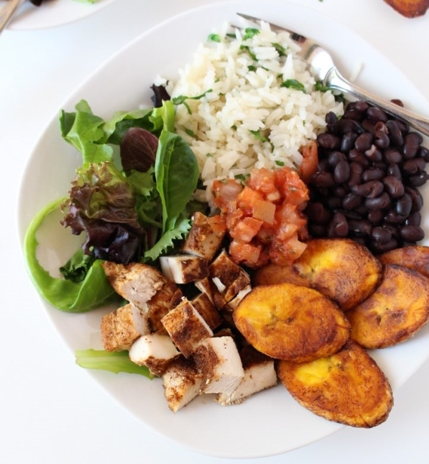

On March 17th, the Minister of Education of Wallonia-Brussels Federation Caroline Desir stated that over 130 Ukrainian students are already enrolled in FWB (Wallonia-Brussels Federation) schools, but this number ‘will increase very quickly and very very strongly.’ With the war impacting students directly, a question hangs in the air: Is it fair that Russian students are receiving support alongside Ukrainians?

## Ingredients

* 1 cup uncooked jasmine rice
* 2 cups broth (or water)
* 1 (15oz) can black beans
* 3 chicken breasts
* 2 large plantains (very ripe)
* 1/3 cup cilantro, chopped
* 3 cups mixed greens
* salt and pepper to taste
* 3-4 tbsp coconut oil
* 2 tbsp extra virgin olive oil
* 2 tbsp paprika
* toppings: pico de gallo, sour cream, avocado

## Method

1. In a medium size pot, combine the rice and broth (or water), season with a pinch of salt and pepper. Cover, bring to a boil. Once boiling, turn the heat down to low and simmer for 20 minutes, until all of the liquid is absorbed. Remove from heat when done and stir in the chopped cilantro. 
2. While the rice cooks, prepare the chicken. Preheat a large cast iron skillet over medium-high heat, and add the olive oil. Chop up the chicken breasts into bite size pieces, then season with the paprika, salt, and pepper. 
3. Add the chicken to the pan in an even layer (you may have to work in batches in order to not crowd the pan), and let it cook for 8-10 minutes, stirring occasionally. Once the chicken is golden brown and cooked through, remove from the heat and set aside.
4. Rinse and drain the black beans, then add them to a saucepan with a few tbsp of water. Season with salt and pepper, turn the heat to low and let them slowly heat through as you cook the plantains.
5. Lastly, prepare the plantains. Peel and slice the plantains on a bias, then preheat the skillet over medium heat. Add the coconut oil, then add the plantains. Let them cook on one side for about 3 minutes, season with a pinch of salt, then flip and cook for another 2-3 minutes. You want the plantains to turn golden brown. Work in batches so that you don't crowd the pan, then set aside. 
6. To assemble: lay down a handful of greens on a plate, then spoon the rice, beans, and chicken over the top. Add a few pieces of plantain to the plate, then top with your desired toppings (pico de gallo, sour cream, avocado, more cilantro)

* Serves: 4
* Cooking time: 35 minutes

  