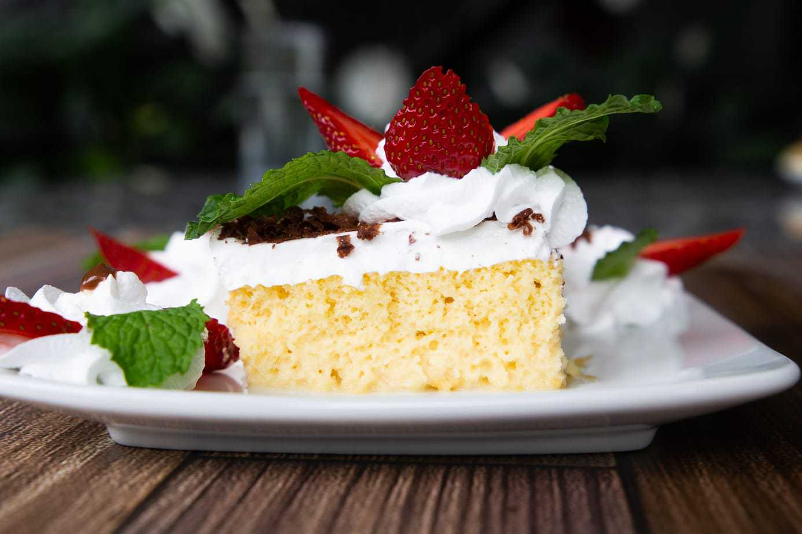
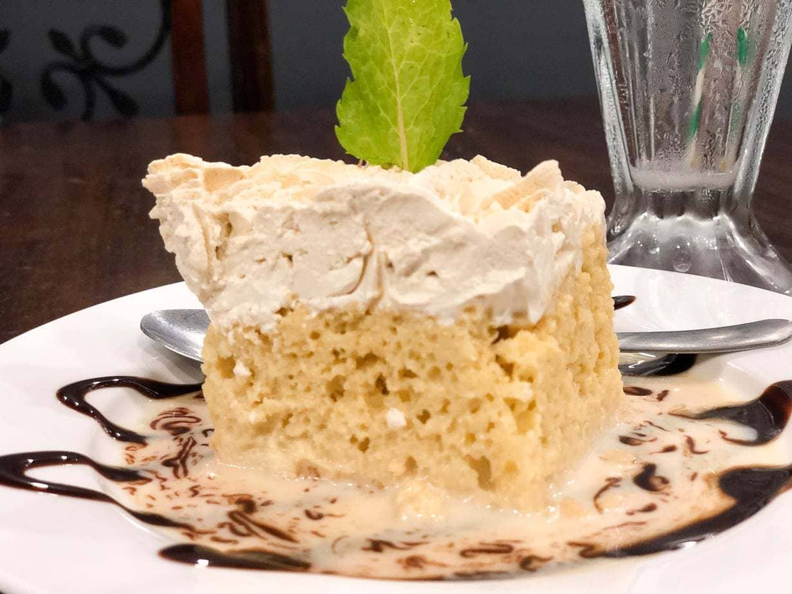

Tres leches cake is a favorite Costa Rican recipe- and the most delicious dessert. It’s a sponge cake baked from scratch with sugar, flour, eggs and vanilla. Add three types of milk- evaporated milk, heavy cream and sweetened condensed milk and top with whipped topping for an incredibly rich flavor.  

## Ingredients

* 4 eggs, room temperature and separated yolk from the whites
* 1/2 cup milk (whole milk preferred)
* 1 cup sugar
* Pinch of salt
* 1 teaspoon vanilla extract 
* 1 cup white flour
* 1 tablespoon baking powder
* Non-stick cooking spray
* Milk Cake sauce ingredients:
* 1 cup sweetened condensed milk (leche condensada)
* 1 cup evaporated milk  (leche evaporada)
* 1 cup heavy cream
* 1 cup whole milk (optional- cuts down on the sweet taste of the sauce if you feel it is too sweet)

## Method

1. Separate the egg yolks from the whites for each of your eggs. I personally think that using room-temperature eggs works better.
2. In your mixer or mixing bowl, add the egg yolks and beat, using a whisk attachment, on medium speed until the yolks turn a pale yellow.
3. While mixing the yolks, measure out dry ingredients into a medium bowl (flour, baking powder and salt) into a bowl and whisk until combined. 
4. Next, add 1/3 cup milk and vanilla to the egg yolk mixture and stir. Pour the whole thing over the flour mixture and stir until just combined. 
5. In a separate large bowl, beat the egg whites until soft peaks form. Add the remaining 1/4 cup sugar and beat until stiff peaks form (forme picos).
6. Add the egg white mixture to the flour mixture and stir. Your cake batter should be light and airy. Pour into your baking pan and place in the center rack of the oven.
7. Bake this cake for about 20 to 25 minutes. It is done when a toothpick inserted comes out clean- up to about 30 minutes. 
8. While the cake is baking, you can stir or whisk together the three kinds of milk for the sauce. 
9. Allow to cool slightly - the cake will be spongy and the sides of the cake will naturally pull away from the edges of the baking pan. Poke holes into the cake with a fork, and pour the milk mixture over the entire cake until absorbed. Let the cake cool fully. You can keep it refrigerated for up to three days.

* Serves: 24 small pieces, 12 large
* Cooking time: 30 minutes
* Preparation time: 15 minutes

