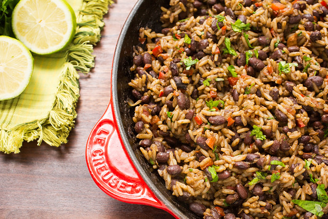
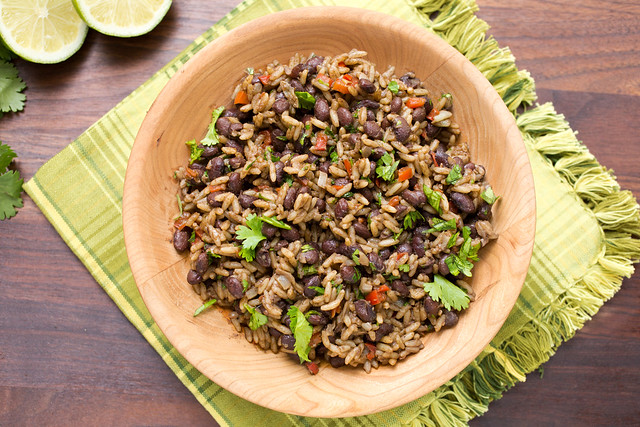

Traditionally served with breakfast alongside fried or scrambled eggs, Gallo Pinto is a hearty and delicious traditional Costa Rican dish. It’s a cinch to prepare, too!

## Ingredients

* 2 tablespoons light-tasting oil (vegetable, mild olive, canola)
* 1 red bell pepper, chopped
* 1 small yellow onion, chopped
* 2 cloves garlic , minced 
* 2 cups cooked black beans, in 3/4 cup reserved cooking liquid
* 1/4 cup Salsa Lizano
* 3 cups cooked rice , preferably, day-old and refrigerated
* 1/4 cup chopped fresh cilantro

## Method

1. Heat oil in a large skillet over medium-high heat until shimmering. Sauté chopped bell pepper and onions until peppers are soft and onions are translucent, about 6-8 minutes. Add minced garlic and cook for 1 minute, until fragrant.
2. Add black beans, reserved cooking liquid, and Salsa Lizano, stirring to combine. Simmer for 5 minutes, until slightly thickened and little bit of the liquid is evaporated. Gently stir in cooked rice and cook until heated through and most of the liquid is absorbed, about 3-5 minutes.
3. Stir in chopped cilantro. Season to taste with additional Salsa Lizano, if desired, and serve.

* Serves: 8-10
* Preparation time: 10 minutes
* Cooking time: 20 minutes

