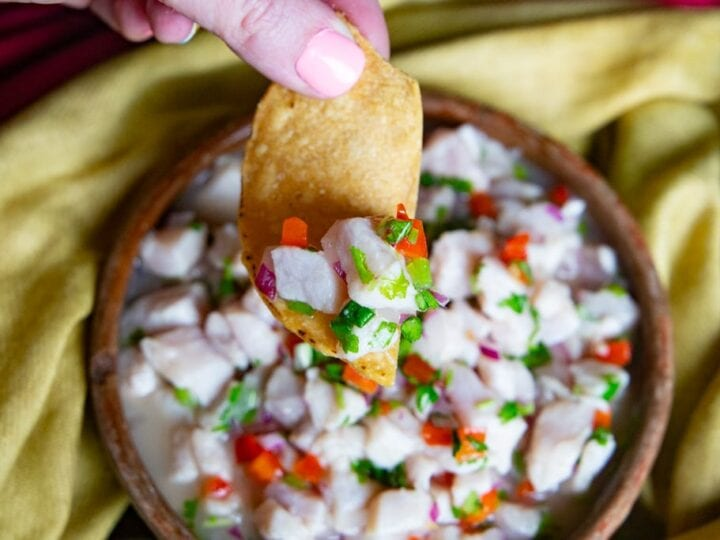

The perfect appetizer that can be found all across Latin America, and Costa Rica is no exception. Fresh fish marinated in lime, red bell pepper, cilantro and onion make for a delicious and easy recipe.

There are several variations to this recipe - instead of white fish, Costa Rican ceviches can also be made with shrimp, green banana, green mango, green papaya, etc.

## Ingredients

* 1 pound of raw corvina (white sea bass or other firm white fish), cut into 1/2-inch dice
* 1 cup fresh lime juice (enough juice to completely cover and “cook” the fish)
* 2 medium red bell peppers, finely chopped
* 1 medium onion, finely chopped
* 1 large handful of fresh cilantro, finely chopped
* 1/2 cup of ginger ale (optional, see note below)
* 1/2 cup of club soda
* salt and pepper to taste

NOTE: The ginger ale is what makes it Costa Rican; it’s also what makes it not paleo. So… if you want to have some fun, use the ginger ale. If you want to remain clean, omit the ginger ale and increase the club soda to 1 cup.

## Method

1. Combine all ingredients in a large glass bowl, cover tightly with plastic wrap, and allow the fish to “cook” in the marinade for at least 30 minutes. Tastes best after at least 6-8 hours; phenomenally good on the second day.
2. Serve with on a bed of lettuce with sliced avocado, bell pepper strips, cucumber slices, and, if you’re feeling particularly Costa Rican, a healthy splash of Salsa Lizano - the quintessential Costa Rican sauce that you can find on [Amazon.com](https://www.amazon.com/gp/product/B005TBURAI/ref=as_li_ss_tl?ie=UTF8&tag=roltheboo-20&linkCode=as2&camp=1789&creative=390957&creativeASIN=B005TBURAI).

* Serves: 3-4
* Preparation time: 10 minutes
* Marinate 30 minutes minimum