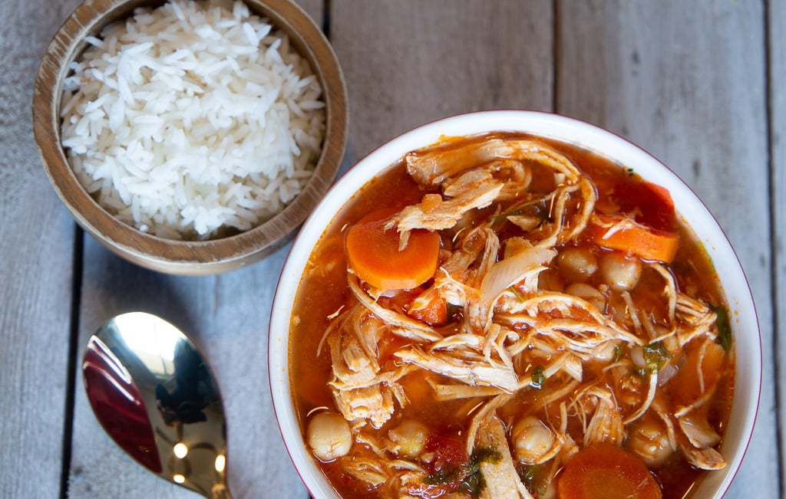

This savory garbanzo bean soup is packed with protein and fiber- and traditionally Costa Rican! With ingredients such as shredded chicken, tomato, carrots and chickpeas, this soup is a winner for family dinner!

This soup is a very popular dish in Costa Rica- but you will almost never find it on a menu. It’s one of those recipes people make at home, but don’t go out to eat and crave. That’s probably because it’s simple to make from scratch, and can be reheated for several rounds of meals. It’s a relatively inexpensive recipe if you are feeding your family on a budget, and it’s easy to feed a crowd.

## Ingredients

* 1 lb shredded chicken breast
* 1/2 red pepper, finely chopped
* 1/2 medium white or yellow onion, finely chopped
* 2 cloves garlic, pressed
* 1/2 bunch cilantro, finely chopped
* 5 C chicken broth (canned or from the shredded chicken recipe above)
* 1TB salt
* 1/3 cup ketchup
* 1 TB butter or olive oil
* 2 cans garbanzo beans, undrained
* 1 can diced tomato
* 2 carrots, diced (optional)

## Method

1. In a large stockpot, either cook the bacon and remove leaving the bacon grease for your sofrito, or heat the butter or olive oil.
2. Add onion, red pepper, and garlic and cook until softened. Add the chicken, one cup of broth, and the salt and bring to simmer.
3. In a blender, add the can of tomatoes, one cup of chicken broth, and the ketchup.  Blend until smooth and add to the pan with the sofrito and chicken.
4. Next you will add one can of undrained garbanzos and the optional carrots to the pot and stir. Bring back to a simmer. At this point, you can add drained garbanzos and chicken broth until you get the consistency of broth that you desire. For me, I like to have a lot of chickpeas and a pretty brothy soup. Add salt to taste, and bring to a boil on medium-high, then cook, stirring occasionally, for about 25 minutes to let the flavors really blend.
5. I usually add the cilantro about 5 minutes before serving, or you can garnish the soup with fresh cilantro on top. Season with salt and pepper to taste.
6. This soup is traditionally served in a deep bowl with white rice on the bottom and covered with soup. I like to forgo the rice and eat with tortilla chips and avocado slices. *¡Buen provecho!*

### Substitutions

You can substitute boxed chicken broth for homemade. You can also just use a rotisserie chicken and shred up the meat instead of cooking a whole chicken or preparing shredded chicken breasts.

Some recipes substitute bacon grease for the olive oil, and then add chunks of bacon into the soup.

Finally- you can omit the ketchup and just use two cans of tomatoes.

If you aren’t a fan of garbanzo beans, you could also make this with white beans, like Great Northern.

* Serves 6
* Cooking time 25 minutes
* Preparation time 5 minutes